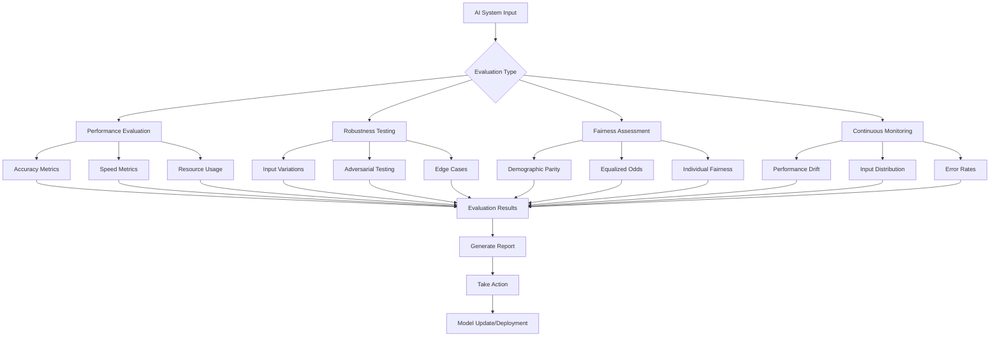
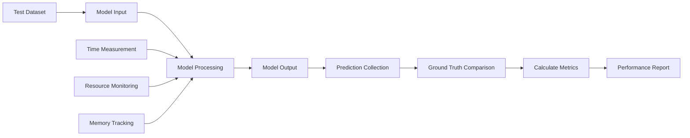
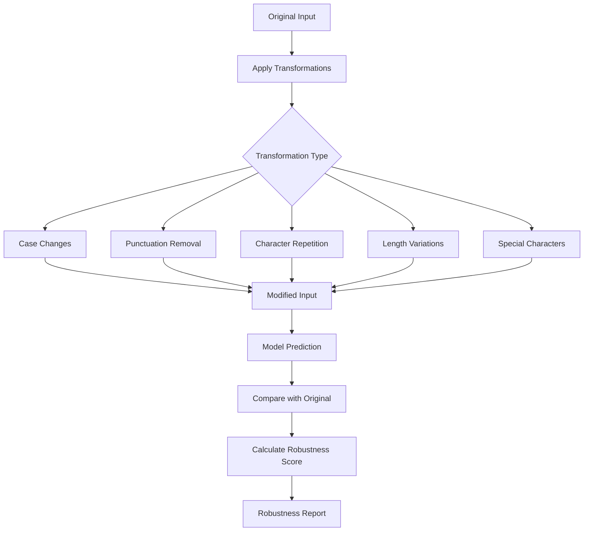
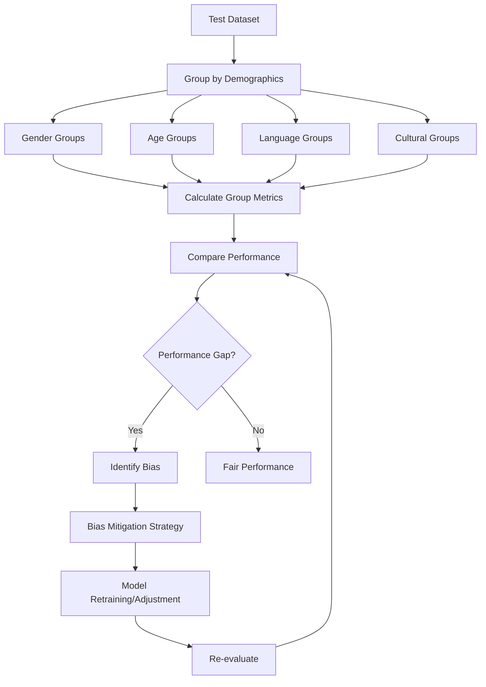
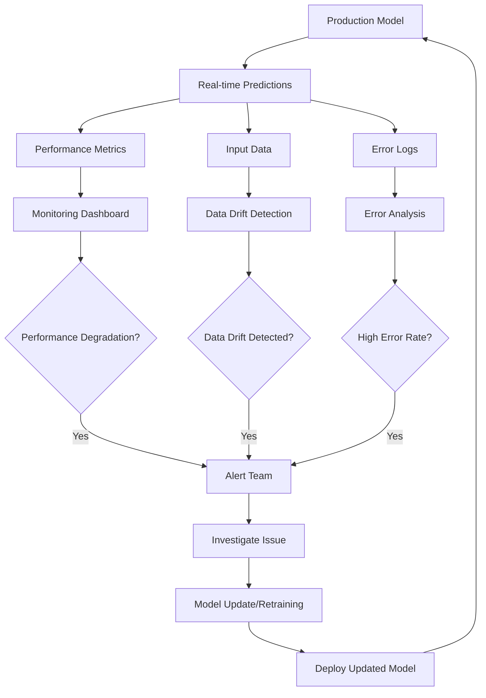
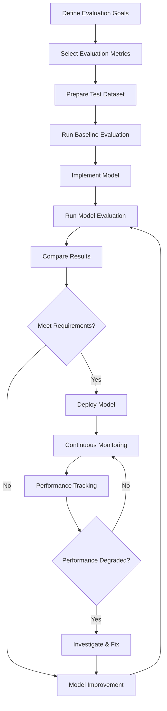

# Chapter 4: Evaluating AI Systems

## Overview

Chapter 4 focuses on practical techniques for evaluating the performance, robustness, and fairness of AI systems built with foundation models. This chapter builds upon the theoretical foundations from Chapter 3 and provides hands-on implementation strategies for ensuring AI systems meet real-world requirements.

## Why Systematic Evaluation Matters

Evaluating AI systems is crucial for ensuring they meet real-world requirements. Foundation models, while powerful, can exhibit unexpected behaviors that need to be systematically identified and addressed. Without proper evaluation, AI systems may fail in production, exhibit biases, or provide unreliable results.

### Key Evaluation Dimensions

- **Performance**: Accuracy, speed, and efficiency metrics that determine how well the model performs its intended task
- **Robustness**: How well the model handles edge cases, adversarial inputs, and unexpected situations
- **Fairness**: Detecting and mitigating biases that could affect different groups of users
- **Reliability**: Consistency across different inputs and conditions over time

## Evaluation Framework Overview



## Evaluation Frameworks

### 1. Performance Evaluation

Performance evaluation focuses on measuring how well the model performs on its intended task. This includes both accuracy metrics and operational metrics that affect real-world deployment.

**Accuracy Metrics**: These measure how correct the model's predictions are:
- **Precision**: Proportion of true positives among predicted positives (important when false positives are costly)
- **Recall**: Proportion of true positives among actual positives (important when false negatives are costly)
- **F1-score**: Harmonic mean of precision and recall, providing a balanced measure
- **Overall Accuracy**: Percentage of correct predictions across all classes

**Speed Metrics**: These measure how quickly the model responds:
- **Inference Time**: Time taken for a single prediction
- **Throughput**: Number of requests handled per unit time
- **Latency**: End-to-end time including preprocessing and postprocessing

**Resource Usage**: These measure the computational requirements:
- **Memory Consumption**: RAM usage during inference
- **CPU/GPU Utilization**: Processing power requirements
- **Model Size**: Storage requirements and deployment considerations

### Performance Evaluation Flow



### 2. Robustness Testing

Robustness testing ensures the model performs well under various conditions that it might encounter in real-world usage. This is especially important for foundation models that may be used in diverse contexts.

**Input Variations**: Testing how the model handles different formats and styles:
- **Case Sensitivity**: Does the model work with uppercase, lowercase, or mixed case?
- **Punctuation**: How does the model handle different punctuation styles?
- **Length Variations**: Does performance degrade with very short or very long inputs?
- **Format Changes**: How does the model handle different text formats or structures?

**Adversarial Inputs**: Testing against intentionally difficult or malicious inputs:
- **Perturbations**: Small changes that shouldn't affect the output
- **Out-of-Distribution**: Inputs that are very different from training data
- **Malicious Inputs**: Attempts to trick or confuse the model

**Edge Cases**: Testing unusual or boundary conditions:
- **Empty Inputs**: How does the model handle null or empty inputs?
- **Extreme Values**: Very large numbers, very long texts, or unusual characters
- **Boundary Conditions**: Inputs at the limits of what the model can handle

### Robustness Testing Process



### 3. Fairness Assessment

Fairness evaluation identifies potential biases in model outputs that could affect different groups of users. This is crucial for ensuring AI systems are equitable and don't perpetuate existing societal biases.

**Demographic Parity**: Ensuring equal performance across different demographic groups:
- **Gender**: Does the model perform equally well for different genders?
- **Age**: Are there performance differences across age groups?
- **Language**: Does the model work equally well for different languages or dialects?
- **Cultural Context**: Are there biases related to cultural background?

**Equalized Odds**: Ensuring similar false positive and false negative rates across groups:
- **False Positive Rate**: Rate of incorrect positive predictions
- **False Negative Rate**: Rate of incorrect negative predictions
- **Balanced Performance**: Ensuring no group is systematically disadvantaged

**Individual Fairness**: Ensuring similar treatment for similar individuals:
- **Consistency**: Similar inputs should produce similar outputs
- **Transparency**: Understanding why certain decisions were made
- **Accountability**: Ability to explain and justify model decisions

### Fairness Assessment Flow



## Practical Implementation

Let's implement a comprehensive evaluation system using modern tools and libraries. The key is to create a systematic approach that can be automated and repeated consistently.

### Prerequisites and Installation

```bash
pip install transformers evaluate datasets torch scikit-learn numpy pandas matplotlib seaborn
```

### Basic Evaluation Example

```python
# Example: Basic evaluation of a foundation model

import torch
from transformers import BertTokenizer, BertForSequenceClassification
from sklearn.metrics import accuracy_score, precision_recall_fscore_support
import time

# Load model and tokenizer
tokenizer = BertTokenizer.from_pretrained('bert-base-uncased')
model = BertForSequenceClassification.from_pretrained('bert-base-uncased', num_labels=2)
model.eval()

# Simple test dataset
test_texts = [
    "This product is amazing!",
    "Terrible experience, would not recommend.",
    "Great service and quality.",
    "Poor customer support."
]
test_labels = [1, 0, 1, 0]  # 1: positive, 0: negative

# Evaluate performance
predictions = []
inference_times = []

for text, label in zip(test_texts, test_labels):
    # Tokenize and predict
    inputs = tokenizer(text, return_tensors="pt", truncation=True, padding=True)
    
    start_time = time.time()
    with torch.no_grad():
        outputs = model(**inputs)
        pred = torch.argmax(outputs.logits, dim=1)
    inference_time = time.time() - start_time
    
    predictions.append(pred.item())
    inference_times.append(inference_time)

# Calculate metrics
accuracy = accuracy_score(test_labels, predictions)
precision, recall, f1, _ = precision_recall_fscore_support(test_labels, predictions, average='weighted')
avg_inference_time = sum(inference_times) / len(inference_times)

print(f"Accuracy: {accuracy:.3f}")
print(f"Precision: {precision:.3f}")
print(f"Recall: {recall:.3f}")
print(f"F1 Score: {f1:.3f}")
print(f"Average Inference Time: {avg_inference_time:.4f} seconds")
```

### Robustness Testing Example

```python
# Example: Testing model robustness

def test_robustness(model, tokenizer, base_texts, base_labels):
    """Test model robustness with various input modifications"""
    
    robustness_tests = {
        'Uppercase': lambda x: x.upper(),
        'Extra Spaces': lambda x: x.replace(' ', '   '),
        'No Punctuation': lambda x: x.replace('.', '').replace('!', ''),
    }
    
    for test_name, transformation in robustness_tests.items():
        # Apply transformation
        modified_texts = [transformation(text) for text in base_texts]
        
        # Evaluate
        predictions = []
        for text in modified_texts:
            inputs = tokenizer(text, return_tensors="pt", truncation=True, padding=True)
            with torch.no_grad():
                outputs = model(**inputs)
                pred = torch.argmax(outputs.logits, dim=1)
                predictions.append(pred.item())
        
        # Calculate accuracy
        accuracy = accuracy_score(base_labels, predictions)
        print(f"{test_name} accuracy: {accuracy:.3f}")
```

## Advanced Evaluation Techniques

### Using Hugging Face Evaluate Library

The Hugging Face evaluate library provides standardized evaluation metrics and makes it easy to compare different models consistently.

```python
# Example: Using Hugging Face evaluate library

from evaluate import evaluator, load
from datasets import Dataset

# Create dataset
dataset = Dataset.from_dict({
    "text": ["I love this!", "This is terrible.", "Great product."],
    "label": [1, 0, 1]
})

# Initialize evaluator
task_evaluator = evaluator("text-classification")

# Run evaluation
results = task_evaluator.compute(
    model_or_pipeline=model,
    data=dataset,
    tokenizer=tokenizer,
    metric="accuracy"
)

print(f"Evaluation results: {results}")
```

## Continuous Monitoring

Continuous monitoring is essential for production AI systems. Models can degrade over time due to data drift, changing user behavior, or external factors.

### Key Monitoring Metrics

1. **Performance Drift**: Monitor accuracy, precision, recall over time
2. **Input Distribution**: Track changes in input patterns and characteristics
3. **Error Rates**: Monitor different types of errors and their frequency
4. **User Feedback**: Collect and analyze user satisfaction scores
5. **System Health**: Monitor latency, throughput, and resource usage

### Continuous Monitoring Architecture



### Monitoring Implementation

```python
# Example: Simple monitoring setup

import json
from datetime import datetime

class ModelMonitor:
    def __init__(self, model_name):
        self.model_name = model_name
        self.performance_log = []
    
    def log_evaluation(self, accuracy, precision, recall, f1, inference_time):
        """Log evaluation results with timestamp"""
        log_entry = {
            'timestamp': datetime.now().isoformat(),
            'accuracy': accuracy,
            'precision': precision,
            'recall': recall,
            'f1_score': f1,
            'avg_inference_time': inference_time
        }
        self.performance_log.append(log_entry)
        
        # Alert if performance degrades
        if accuracy < 0.8:
            print(f"WARNING: Model accuracy degraded to {accuracy:.3f}")
        
        return log_entry
    
    def save_log(self, filename="model_performance_log.json"):
        """Save performance log to file"""
        with open(filename, 'w') as f:
            json.dump(self.performance_log, f, indent=2)

# Usage
monitor = ModelMonitor("bert-sentiment")
monitor.log_evaluation(accuracy, precision, recall, f1, avg_inference_time)
monitor.save_log()
```

## Evaluation Best Practices

### 1. Automate Everything

Manual evaluation is error-prone and doesn't scale. Use scripts and pipelines for consistent, repeatable evaluation:
- **Automated Testing**: Set up CI/CD pipelines for model evaluation
- **Standardized Metrics**: Use consistent evaluation metrics across all models
- **Version Control**: Track model versions and their performance
- **Documentation**: Document evaluation procedures and results

### 2. Use Diverse Test Cases

Include a wide variety of test cases to ensure comprehensive evaluation:
- **Representative Data**: Test cases that reflect real-world usage
- **Edge Cases**: Unusual inputs that might cause problems
- **Adversarial Examples**: Inputs designed to test model robustness
- **Cross-Domain**: Test performance across different domains or contexts

### 3. Benchmark Against Baselines

Always compare your model against appropriate baselines:
- **Simple Models**: Compare against rule-based or simpler ML models
- **Previous Versions**: Track improvements over model iterations
- **Industry Standards**: Compare against published benchmarks
- **Human Performance**: Where applicable, compare against human experts

### 4. Monitor Continuously

Set up continuous monitoring for production models:
- **Real-time Monitoring**: Track performance metrics in real-time
- **Alerting**: Set up alerts for performance degradation
- **A/B Testing**: Compare different model versions
- **User Feedback**: Collect and analyze user satisfaction

### 5. Document Everything

Maintain comprehensive documentation of evaluation procedures:
- **Evaluation Protocol**: Document how evaluations are conducted
- **Results Tracking**: Keep detailed records of all evaluation results
- **Decision Logging**: Document decisions made based on evaluation results
- **Reproducibility**: Ensure evaluations can be reproduced by others

### Evaluation Workflow



## Key Terms

- **Performance Evaluation**: Measuring accuracy, speed, and efficiency
- **Robustness Testing**: Ensuring model reliability under various conditions
- **Fairness Assessment**: Detecting and mitigating biases in model outputs
- **Continuous Monitoring**: Ongoing evaluation of deployed models
- **Adversarial Testing**: Testing with intentionally difficult or malicious inputs
- **Data Drift**: Changes in input data distribution over time
- **Model Degradation**: Decline in model performance over time

## Key Takeaways

1. **Systematic evaluation is essential** for ensuring AI system quality and reliability. Without proper evaluation, models may fail in production or exhibit unexpected behaviors.

2. **Multiple evaluation dimensions** (performance, robustness, fairness) provide comprehensive insights into model behavior. Each dimension reveals different aspects of model quality.

3. **Automation and continuous monitoring** are crucial for production systems. Manual evaluation doesn't scale and can miss important issues.

4. **Modern evaluation libraries** like Hugging Face's evaluate provide powerful tools for standardized evaluation. These tools ensure consistency and reproducibility.

5. **Documentation and logging** ensure reproducibility and accountability. Proper documentation helps teams understand and improve evaluation processes over time.

6. **Fairness evaluation is crucial** for ensuring AI systems are equitable and don't perpetuate biases. This is especially important for models used in high-stakes applications.

7. **Robustness testing reveals** how models handle real-world conditions. Models that work well on clean data may fail on noisy or adversarial inputs.

8. **Continuous monitoring catches** performance degradation early, allowing for timely intervention and model updates. 